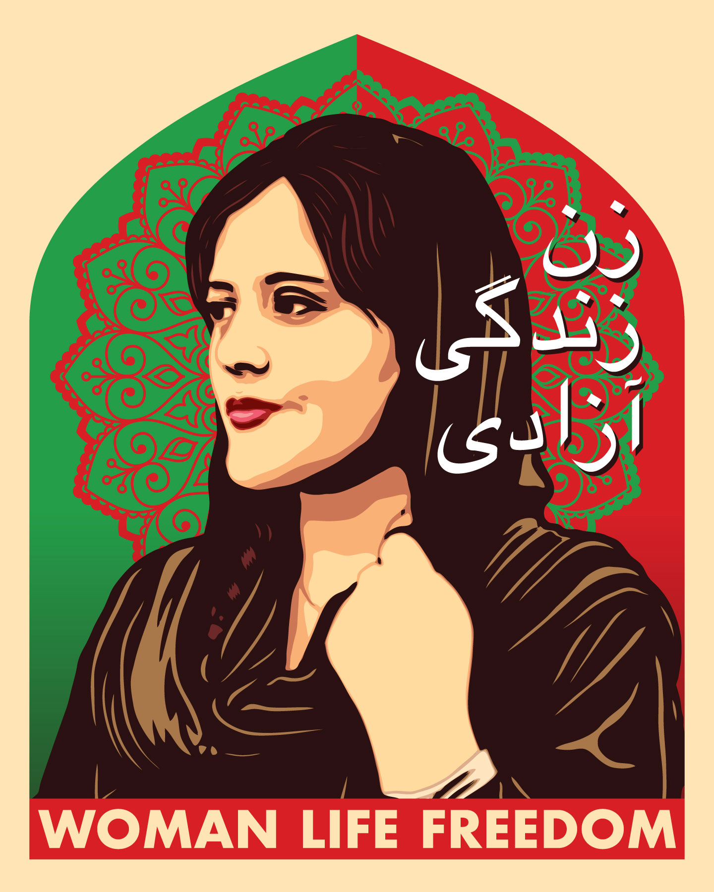

    

<h3>Hi there 👋 , I'm Amen </h3>

   

<b>🚀 Backend Engineer | Open Source Enthusiast | Decentralization Advocate</b>

Hey! I'm a passionate coder who's always eager to learn and share knowledge. Problem-solving is my thing, and collaboration makes it even better. Let's build a future where open-source drives innovation, and everyone has the freedom to explore, create, and grow. Coding isn't just a job—it's a movement. 🌱

Let’s code for a better world. 🔥

|  |  |
| ------------- | ------------- |
