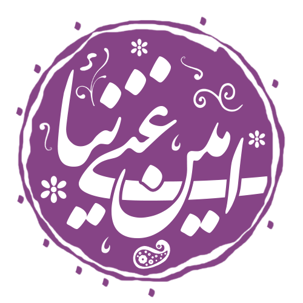

    

<h3>Hi there 👋 , I'm Amen </h3>

   

a simple programmer 😊 fun to work with, I always like to learn new things from others as much as helping others solve their problems. You know what else is fun! Learning code is. Let's work for a better opensource, decentralized future. A world where everything is free and everyone is free to experiment, learn, survive and thrive. Let's code for good.🎉

|  |  |
| ------------- | ------------- |

